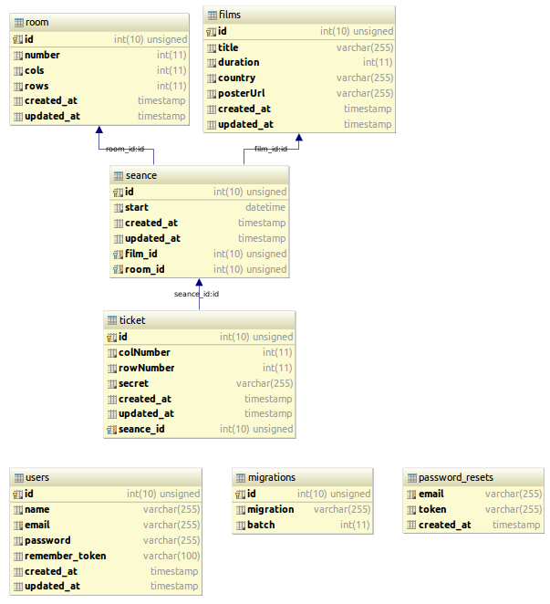

####Тестовое задание "Кинотеатр"

[]

###[DEMO](http://protected-castle-80367.herokuapp.com/)

Создать всю необходимую структуру
 - Реализовать функции «Посмотреть, какое кино идет в ближайшее время» и
«Купить билеты».
 - Написать заполнение базы seed-ами
 - Написать на phpunit тест на проверку кол-ва свободных мест на сеанс

#####Планируемое описание сущностей:
######фильм
  - id
  - название
  - продолжительность (в минутах)
  - страна
  - img url постер
######сеанс
 - id
 - id фильма
 - id зала
 - время начала сеанса datetime
######зал
 - id
 - номер
 - общее количество рядов
 - общее количество мест в ряду
######билет 
 - id
 - id сеанса
 - номер ряда
 - номер места
 - секрет (код для проверки на входе)

#####методы контроллера:
######GET  /timetable
  метод "получить список ближайших фильмов"
  select * фильм join сеанс where datetime < текущее_время
  у каждого фильма есть dropdown c выбором сеанса, зала, ряда и номер места в ряду.

######POST /buyTicket //метод "купить билет"
params:  //входные параметры:
 - film name // название фильма,
 - start datetime //время сеанса,
 - room number // номер зала, 
 - row number //номер ряда, 
 - col number //  номер места 

####Схема базы данных
